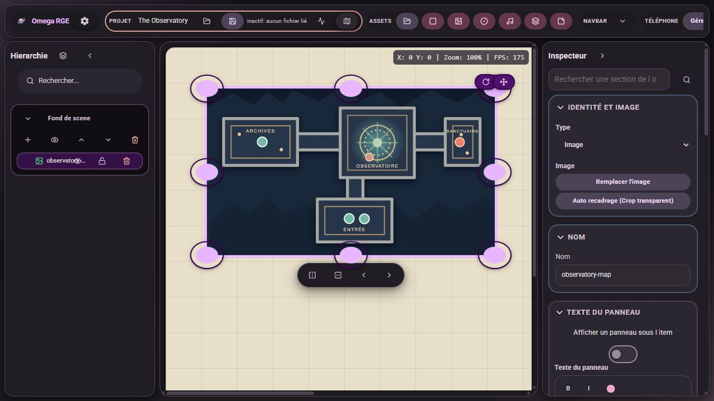
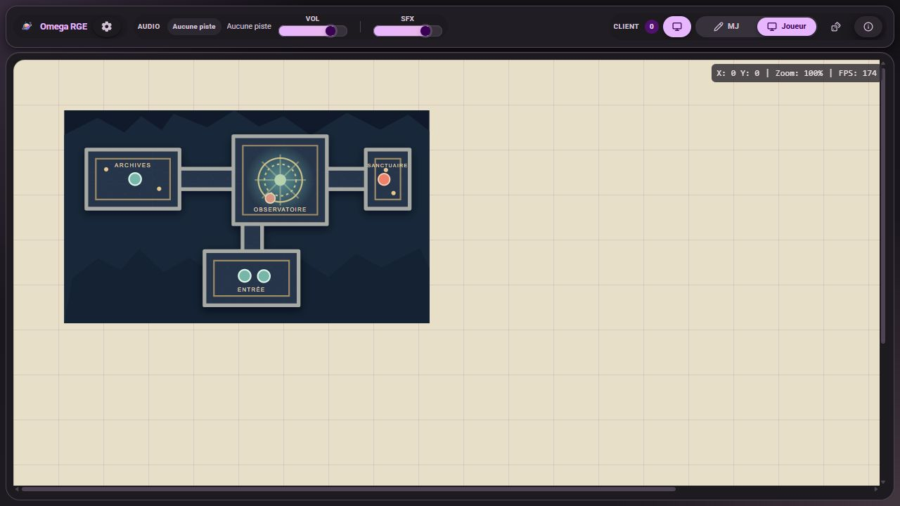

<div align="center">
  

  # OmegaRoleGameEditor

  **Build tabletop scenes, run your game, and share a dedicated view with players.**

  Map editor · Virtual tabletop · Real-time sessions
</div>

---

## Preview

| Game Master editor | Player view |
| :---: | :---: |
|  |  |

The screenshots use an original [demo map](docs/demo/observatory-map.svg) made for this repository.

## Features

| Build | Run | Share |
| --- | --- | --- |
| Import images and tokens, arrange layers and nested objects, then move and transform scene elements. | Prepare notes, effects, audio, dice, and other Game Master tools. | Host a room with Express and WebSocket, then stream the visible scene to players. |

The Game Master editor and player view are separate. Hidden elements and editing-only information are not sent to players.

## Quick start

**Requirements:** Node.js and npm. Google Chrome is recommended for file handling and some scene interactions.

```bash
npm ci
npm run dev:full
```

Open **http://localhost:5173**. The session server listens on **http://localhost:8787** by default. You can change both ports in [`config.json`](config.json).

1. Switch to **MJ** (Game Master) mode and create a terrain.
2. Add images, tokens, and layers; edit their properties in the inspector.
3. Use **Sauvegarder sous…** (Save As) to export the scene.
4. Open **Host** mode and share the room code with your players.
5. Players switch to **Joueur** (Player) mode to join the session.

## Portable saves

Each terrain exports as **one `.terrain.json` file**. Images are embedded as Data URLs, so the scene can travel without a separate asset directory. Older terrain JSON files remain loadable as the format evolves.

## Stack and scripts

**Client:** Vite, React, TypeScript, Material UI. **Session server:** Express and WebSocket.

| Command | Purpose |
| --- | --- |
| `npm run dev:full` | Start the client and session server together. |
| `npm run dev` | Start only the client. |
| `npm run dev:server` | Start only the session server. |
| `npm run build` | Check TypeScript and build the production client. |
| `npm test` | Run business logic tests. |
| `npm run lint` | Run ESLint. |

The client lives in [`src/`](src), the server in [`server/`](server), and public assets in [`public/`](public). Personal campaigns are not included in this repository.
